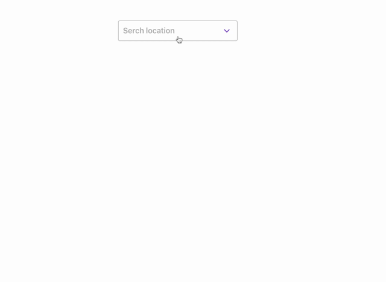

# Weather App
Search for your location and display the current weather conditions as well as a forecast



## Assumptions
- I have only implemented information available to me via the API I chose (no pollen count)
- Implemented using responsive grid for the daily forecasts, this might be better as a horizontally scrolling component

## Descoped - in the interest of time
- 'Current location' requirement. Easy to implement, can use browser Geolocation API to get coordinates, the API I use supports searching by lat/ongs.
- Error messages, called out as TODO comments in code
- There is a transform function happening on the front end that could be done on the backend.
- More testing around edge cases, less snapshots, more verifying elements are displayed 
- Better loading animation and transitions

## Strategy
- Build as many simple functional components as possible
- Use react context to manage simple app state
- Use a good component library that has built in accessibility features
- The API I selected was great because it had a search API built in and the data format was good, but did not allow cross-origin requests. I built a small proxy using firebase functions to enable this to work.

### Install

```sh
yarn --cwd app install && yarn --cwd functions install
```

### Build

```sh
yarn --cwd app build && yarn --cwd functions build
```

### Test

```sh
yarn --cwd app test
```

### Run

```sh
yarn --cwd app start
yarn --cwd functions serve
```
